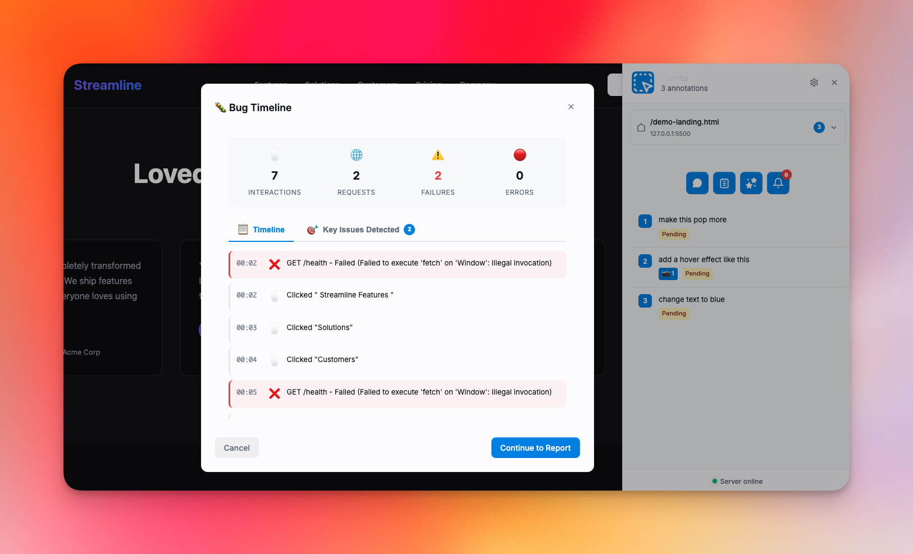
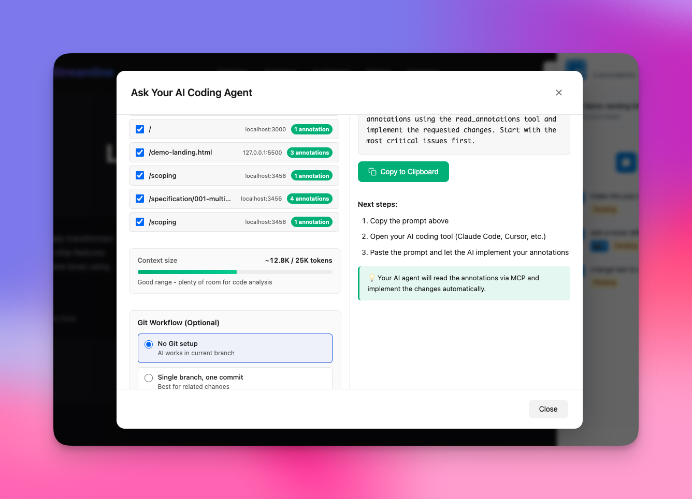
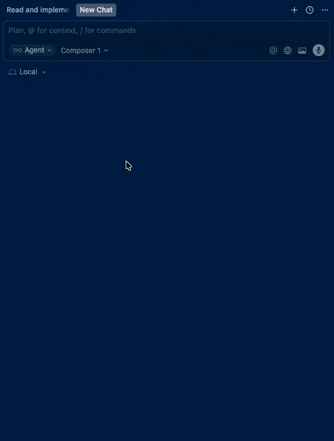

# Pointa

[](https://opensource.org/licenses/MIT)
[](https://chrome.google.com/webstore)
[](https://www.npmjs.com/package/pointa-server)
[](CONTRIBUTING.md)

> Visual feedback tool for local web development that integrates with AI coding agents

🌐 **Website**: [pointa.dev](https://pointa.dev/)


## What is Pointa?

Pointa is a browser extension and local server that lets you add visual annotations to your localhost development projects. Click on any element, leave a comment, and your AI coding agent (Cursor, Claude Code, Windsurf, etc.) can automatically implement the changes.

Think of it as "visual issue tracking" that your AI can read and act on - no more copying CSS selectors or describing which button you're talking about.

Report bugs in seconds



Get your AI coding tool to bulk fix your annotations (through MCP integration)




## Key Features

- 🎯 **Point and click annotations** - Click any element to leave feedback
- 🤖 **AI-ready** - Integrates with AI coding agents via MCP protocol
- 🏠 **Local-first** - Works on localhost, no cloud dependencies
- 📦 **Multi-page tracking** - Annotate across different routes and pages
- 🔒 **Privacy-focused** - All data stays on your machine

## How It Works

### Architecture

Pointa consists of two main components:

```
┌─────────────────────────────────────────┐
│         Browser Extension               │
│  - UI for creating annotations          │
│  - Element selection & highlighting     │
│  - Annotation management interface      │
└───────────────┬─────────────────────────┘
                │
                │ HTTP API
                ▼
┌─────────────────────────────────────────┐
│         Local Server (Node.js)          │
│  - MCP server for AI agents             │
│  - HTTP API for extension               │
│  - File-based storage (~/.pointa)       │
└─────────────────────────────────────────┘
```

**1. Browser Extension** (`/extension`)
- Chromium-based extension (Chrome, Edge, Brave, etc.)
- Injects UI for creating and viewing annotations
- Communicates with local server via HTTP
- Provides visual feedback on annotated elements

**2. Local Server** (`/annotations-server`)
- Node.js server running on port 4242
- Exposes MCP protocol for AI coding agents
- Stores annotations in `~/.pointa` directory
- RESTful API for extension communication

**3. Data Flow**
```
User clicks element → Extension captures context → Server stores annotation
                                                            ↓
AI Agent ← MCP Protocol ← Server provides annotation data
```




## Quick Start

### Prerequisites

- Node.js 18+ 
- Chromium-based browser (Chrome, Edge, Brave, etc.)
- An AI coding agent that supports MCP (Cursor, Claude Code, Windsurf, etc.)

### Installation

**1. Install the server**

```bash
npm install -g pointa-server
pointa-server start
```

**2. Install the browser extension**

Option A: From Chrome Web Store (recommended)
- Install from [Chrome Web Store](https://chromewebstore.google.com/detail/gkofobaeeepjopdpahbicefmljcmpeof)

Option B: Load unpacked (for development)
- Clone this repository
- Open `chrome://extensions/`
- Enable "Developer mode"
- Click "Load unpacked" and select the `/extension` directory

**3. Connect your AI coding agent**

Add the MCP server to your AI agent's configuration:

```json
{
  "mcpServers": {
    "pointa": {
      "url": "http://127.0.0.1:4242/mcp"
    }
  }
}
```

See the [AI Agent Setup](#ai-agent-setup) section for specific instructions.

### Usage

1. Open your localhost development server in your browser
2. Click the Pointa extension icon to activate
3. Click on any element you want to annotate
4. Add your feedback/instructions
5. Ask your AI coding agent to "implement the Pointa annotations"


## AI Agent Setup

<details>
<summary><b>Cursor</b></summary>

1. Open Settings → Cursor Settings
2. Go to Tools & Integrations tab
3. Add this configuration:

```json
{
  "mcpServers": {
    "pointa": {
      "url": "http://127.0.0.1:4242/mcp"
    }
  }
}
```
</details>

<details>
<summary><b>Claude Code</b></summary>

In your project directory:

```bash
claude mcp add --transport http pointa http://127.0.0.1:4242/mcp
```
</details>

<details>
<summary><b>Windsurf</b></summary>

1. Navigate to Settings → Advanced Settings
2. Scroll to the Cascade section
3. Add:

```json
{
  "mcpServers": {
    "pointa": {
      "serverUrl": "http://127.0.0.1:4242/mcp"
    }
  }
}
```
</details>

<details>
<summary><b>Other Editors (VS Code, etc.)</b></summary>

Install an MCP-compatible AI extension and add:

```json
{
  "mcpServers": {
    "pointa": {
      "url": "http://127.0.0.1:4242/mcp"
    }
  }
}
```
</details>

## Server Commands

```bash
# Start the server
pointa-server start

# Check server status
pointa-server status

# Stop the server
pointa-server stop

# Restart the server
pointa-server restart
```

## Development

### Repository Structure

```
pointa-app/
├── extension/              # Browser extension
│   ├── manifest.json       # Extension configuration
│   ├── background/         # Service worker
│   ├── content/            # Content scripts
│   │   └── modules/        # Feature modules
│   ├── popup/              # Extension popup UI
│   └── assets/             # Icons and fonts
│
├── annotations-server/     # MCP server (npm package)
│   ├── bin/cli.js          # CLI entry point
│   ├── lib/server.js       # Server implementation
│   └── package.json        # Server package config
│
└── docs/                   # Documentation
```

### Running Locally

**Extension Development:**

1. Clone the repository
2. Open `chrome://extensions/`
3. Enable Developer mode
4. Click "Load unpacked" → select `/extension` directory
5. Make changes and reload extension to test

**Server Development:**

```bash
cd annotations-server
npm install
npm run dev  # Auto-restarts on changes
```

**Testing the Integration:**

1. Start the server (locally or globally)
2. Load the extension
3. Open a localhost page (e.g., `http://localhost:3000`)
4. Create an annotation
5. Check that it appears in your AI agent's MCP tools

### Code Style

- 2 spaces for indentation
- Meaningful variable names
- Comments for complex logic
- Follow existing patterns in the codebase

### Tech Stack

**Extension:**
- Vanilla JavaScript (no frameworks)
- Chrome Extension Manifest V3
- CSS with custom properties for theming

**Server:**
- Node.js with Express
- MCP SDK (`@modelcontextprotocol/sdk`)
- File-based storage (node-persist)

## Contributing

We welcome contributions! Here's how you can help:

1. **Report bugs** - Open an issue with details about the problem
2. **Suggest features** - Share your ideas in the issues
3. **Submit PRs** - Fix bugs or implement features
4. **Improve docs** - Help make the documentation clearer

Please read [CONTRIBUTING.md](CONTRIBUTING.md) for detailed guidelines.

### Good First Issues

Look for issues labeled:
- `good first issue` - Great for newcomers
- `help wanted` - Community contributions needed

## Known Limitations

- **Shadow DOM**: Elements inside Shadow DOM (Web Components) cannot be annotated due to DOM isolation
- **Local development only**: Designed for localhost/local domains only
- **Chromium browsers**: Currently only supports Chrome-based browsers

## Uninstalling

**Remove the extension:**
- Go to `chrome://extensions/` and remove Pointa

**Uninstall the server:**
```bash
npm uninstall -g pointa-server
rm -rf ~/.pointa  # Remove data directory
```

**Remove from AI agent:**
- Remove the `pointa` entry from your MCP server configuration

## Troubleshooting

**Server not detected**
- Run `pointa-server status` to check if it's running
- Make sure port 4242 is not blocked by firewall

**Extension not working**
- Verify you're on a local development URL (localhost, 127.0.0.1, *.local, etc.)
- Check browser console for errors
- Try reloading the extension

**MCP connection failed**
- Verify server is running
- Check your AI agent's configuration matches the examples
- Restart your AI agent after configuration changes

For more issues, check [GitHub Issues](https://github.com/AmElmo/pointa-app/issues).

## Documentation

- [Development Guide](docs/DEVELOPMENT.md)
- [Update System](docs/UPDATE_SYSTEM.md)
- [Contributing Guidelines](CONTRIBUTING.md)

## License

MIT - see [LICENSE](LICENSE) for details.

## Acknowledgments

Built with ❤️ by [Julien Berthomier](https://github.com/julienberthomier) at [Argil.io](https://argil.io)

---

**Star this repo** if you find it useful! ⭐
